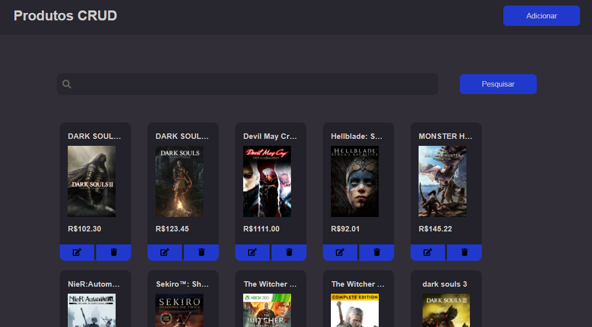
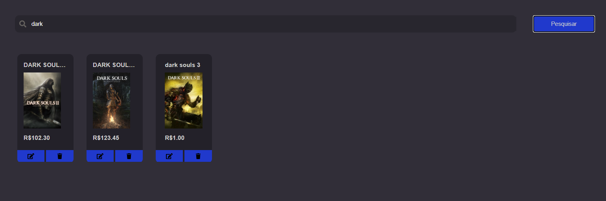
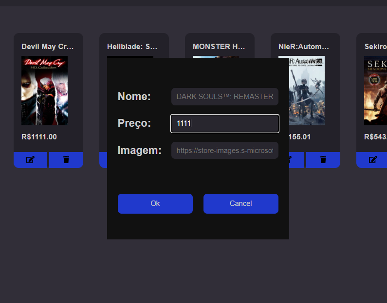

# Desafio Alest

**Objetivo**: construir uma aplicação que possua um frontend (interface para usuário) que permita visualizar, adicionar, remover ou atualizar produtos. Também é necessário que você construa uma API para que através dela possa ser possível visualizar, adicionar, remover ou atualizar produtos.

Os produtos podem ser qualquer coisa que você desejar, por exemplo, tênis, televisões, alimentos, etc. As informações dos produtos devem ser armazenadas no banco de dados Cloud Firestore do Google.

## Screenshot do projeto concluido



## Como rodar o projeto

Primeiro deve-se instalar as dependências e arrumar os arquivos de configurações.

Para arrumar os arquivos de configurações, basta renomear os arquivos, removendo o `.template`:

```
/client/src/services/config.template.ts
/server/src/config.template.ts
```

Depois é só edita-los. No template do cliente, as informações estão corretas para o projeto. No template do servidor, as informações não podem ser públicas, são informações de admin.

Para instalar as dependências:

```
$ cd server
$ yarn install
$ cd ../client
$ yarn intall
```

Enfim, para rodar o servidor:

```
$ cd server
$ yarn start

<em outro terminal>
$ cd client
$ yarn start
```

## Desenvolvimento

Essa foi minha primeira vez trabalhando com firebase, achei bem interessante, gostei.

As etapas do projeto foram:

- criação da API com o express.
- criação da biblioteca para fazer o Crud com o firebase.
    - utilizei as chaves publicas e deixei o acesso ao banco livre.
- criação das rotas e gerenciamento.
- percebi que eu não deveria estar usando as chaves publicas no backend e troquei para chaves de administrador.
    - com essas chaves posso editar o firestore mesmo com o acesso fechado para todos.
- criação do projeto com React.
- criação de uma biblioteca para consumir a API do servidor.
- criação das funcionalidades do frontend.
- criação do sistema de pesquisa
    - eu quebrei a cabeça um pouco achando que daria para fazer a busca pela biblioteca da firebase, acabou que não consegui, talvez tenha uma maneira que eu não tenha encontrado. No final, fiz um sistema de busca no próprio backend, que pega todos os produtos do firestore e busca neles.
- tentativa de criar um sistema de login.
    - consegui fazer o usuário logar utilizando o google, pegar o nome dele, a foto dele, só que não terminei o sistemas, discutirei isso na seção de problemas enfrentados.

## Problemas Enfrentados

O primeiro grande problema foi perceber as regras do banco de dados e a utilização das chaves de admin. Eu fiquei pesquisando e pensando que dependendo da aplicação, não tem a necessidade de criar um backend, a idéia da google é que chaves do projeto possam ser públicas e o administrador configura as regras do banco de dados para evitar falhas de segurança.

Também encontrei problemas com relação ao deploy. Como o projeto tem um backend próprio, fiquei com dúvidas com relação ao deploy do backend. Percebi, que o firebase hosting serve para hostiar páginas estáticas, então imagino que se eu der um build com o React, eu consigo fazer host pelo firebase. Pesquisando mais um pouco, vi que o express tem uma boa integração com o firebase functions, existe uma biblioteca pronta que ja faz o deploy da API em express para o firebase. Porém, o firebase functions não está disponível no plano gratuito, somento no onDemand, acabei ficando com medo de dar deploy e depois por falha de segurança, eu levar um ataque DDOS que me faça pagar absurdos.

Por fim, o problema que mais me incomodou. Não implementei um gerenciador de usuários. Não sei se tinha uma maneira fácil de fazer isso, gastei algumas horas pesquisando. Meu plano era, fazer o usuário autenticar através do firebase authentication, o google me entrega o acess token desse usuário, faço o cliente mandar esse token para o backend, checo se esse token representa esse cliente e libero a edição de items do banco para produtos que possua a ID desse usuário. Porém até eu testar e implementar iria demorar muito e o prazo está acabando, achei melhor deixar de lado.

A biblioteca que eu estava fazendo para autenticação está em `/client/src/service`, o arquivo `firebaseApi.ts` representa o sistema de login, o arquivo `localStorage.ts` representa uma biblioteca para salvar os tokens no LocalStorage, usaria essa biblioteca para guardar os tokens para o usuário não precisar fazer login novamente.

Acretido que tenha sido um erro meu não ter pedido para liberar essa atividade a partir de segunda-feira, eu ja tinha planos da faculdade para esse fim de semana, acabou que ficou meio corrido. A partir de segunda eu teria mais tempo, ai poderia ter estudado o sistema de login melhor. Eu realmente gostaria de ter feito ele.

## Organização do projeto (servidor)

Dentro do diretório src temos o:

- `index.ts`: raiz do express
    - utilizei uma biblioteca chamada `cors` para poder aceitar requisições de fora do domínio do servidor.
- `routes.ts`: o arquivo de rotas que redireciona uma requisição para uma função que se encontra dentro do diretório controllers.
- `config.ts`: onde salvo a chave de administrador e a porta do servidor.
- a pasta de controllers possui funções que tentam tratar os erros das requisições e chamar as funções que estão na biblioteca do firebase dentro do diretório services. Essas funções também respondem o cliente.

## Organização do projeto (client)

Dentro do diretório src temos o:

- `index.tsx`: raiz do react
- dentro do diretório services se encontra a biblioteca para conversar com o servidor e a biblioteca para fazer login. Essas bibliotecas são utilizadas pela página `Home`
- dentro do diretório pages se encontra a página `Home`, esse projeto foi centralizado nela e ela passa todas as funções necessárias para os componentes. Ja tive problemas descentralizando as funções para os componentes, centralizar fica menos confuso na minha opnião.
- dentro do diretório components se encontra os componentes utilizado pela Home.

## Outras Screenshots

Sistema de busca


Sistema de editar produto

